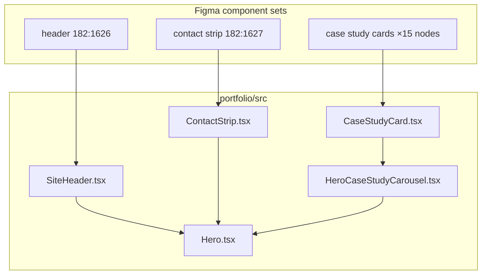

# Portfolio responsive components from Figma

## Summary

Implementation record for three home-page component systems exported from [Portfolio | AI Handoff](https://www.figma.com/design/VibdutrclLgS5EpFWgbJhH/Portfolio-%7C-AI-Handoff): the responsive header, contact strip (pseudo-footer), and case study redirection cards. Each Figma component set spans five breakpoints (360 / 768 / 1366 / 1600 / 1920) and is implemented as a single React component with Tailwind responsive utilities rather than per-breakpoint duplicates.

## Details

### Figma file and workflow

- **File:** `VibdutrclLgS5EpFWgbJhH` — Portfolio | AI Handoff
- **Stack:** Next.js 15, React 19, Tailwind CSS v3, Framer Motion
- **Pattern:** `get_design_context` → adapt to project conventions → commit exported assets to `portfolio/public/assets/`
- **Breakpoints** (from `tailwind.config.ts`): `mobile` 360, `tablet` 768, `desktop` 1024, `laptop` 1366, `wide` 1920

### Component map

| Figma node(s) | Figma name | Code | Used in |
|---------------|------------|------|---------|
| `182:1626` | `header_default_states_responsive` | `SiteHeader.tsx` | `Hero.tsx` |
| `182:1627` | `contact-strip-sticky` / pseudo-footer | `ContactStrip.tsx` | `Hero.tsx` |
| `97:2198`–`97:2026` (+ image atoms) | `organism-case-study-card-*` | `CaseStudyCard.tsx` | `HeroCaseStudyCarousel.tsx` |

### 1. SiteHeader (`182:1626`)

**Path:** `portfolio/src/components/layout/SiteHeader.tsx`

Responsive nav chrome with splash animation integration (`entranceActive` prop from prototype flow).

| Breakpoint | Layout |
|------------|--------|
| **360** | Brand + inline resume link + work-ex gif; nav links below |
| **768** | Brand + integrated resume section in top row; nav links below |
| **1366+** | Nav with brand + large work-ex gif; separate resume card on the right |

**Nav items:** CASE STUDIES 04 · DATA Stories 03 · About_ME

**Assets:** `portfolio/public/assets/header/` — work-ex overlay, photo, briefcase icons (SVG)

**Animation:** Brand-only during splash; full chrome on header-enter (Framer Motion stagger via `splash-phase.ts`).

### 2. ContactStrip (`182:1627`)

**Path:** `portfolio/src/components/layout/ContactStrip.tsx`

Sticky contact footer at the bottom of the home hero.

| Breakpoint | Layout |
|------------|--------|
| **360** | Location row on top (24px globe + text); compact bar below (email + phone only) |
| **768+** | Contact bar left (phone, email, LinkedIn + “LET'S CONNECT”); location right (text + 32px icon) |

**Assets:** `portfolio/public/assets/footer/` — three location icon SVGs (mobile / tablet / desktop)

**Animation:** Footer-enter fade-up (same timing as carousel in prototype).

### 3. CaseStudyCard (15 Figma nodes)

**Path:** `portfolio/src/components/home/CaseStudyCard.tsx`  
**Data:** `portfolio/src/lib/case-studies.ts`

Figma ships separate organism + image-atom component sets per breakpoint. Code collapses these into one responsive card with hover state.

#### Figma node inventory

| Node | Component | Role |
|------|-----------|------|
| `97:2026` | Organism card 1920 | Full card at wide breakpoint |
| `97:2093` / `97:2083` | Image atom 1920 default/hover | Artwork |
| `96:1448` | Organism card 1600 | Full card at desktop breakpoint |
| `96:1653` / `96:1652` | Image atom 1600 default/hover | Artwork |
| `97:1819` | Organism card 1366 | Full card at laptop breakpoint |
| `97:1932` / `97:1922` | Image atom 1366 default/hover | Artwork |
| `97:2113` | Organism card 768 | Full card at tablet breakpoint |
| `97:2180` / `97:2170` | Image atom 768 default/hover | Artwork |
| `97:2198` | Organism card 360 | Full card at mobile breakpoint |
| `97:2265` / `97:2255` | Image atom 360 default/hover | Artwork |

#### Card heights by breakpoint

| Tailwind | Width | Height |
|----------|-------|--------|
| default (360) | 344px | 120px |
| `tablet` (768) | 360px | 152px |
| `laptop` (1366) | 316px | 180px |
| `desktop` (1600) | 375px | 220px |
| `wide` (1920) | 455px | 240px |

#### Default vs hover

| State | Border | Background | Artwork |
|-------|--------|------------|---------|
| Default | 2px `rgba(135,135,135,0.4)` | Stone overlay + `mix-blend-color-burn` | Grayscale PNG |
| Hover (laptop+) | 1.5px `#1d4ed8` + shadow | `#fafafa` | Blue PNG swap |

**Maternity hover special case:** halftone texture overlay at 20% opacity (`maternity-hover-texture.png`).

#### Case study content

| Slug | Title | Tags | Detail route |
|------|-------|------|--------------|
| `insurance` | Insurance | RESPONSIVE · BFSI | `/case-studies/insurance` |
| `maternity` | Maternity | MOBILE · WELLNESS | `/case-studies/maternity` |
| `smart-home` | Smart Home | MOBILE · IOT | `/case-studies/smart-home` |
| `erp` | ERP | SAAS · ADMIN | `/case-studies/erp` |

**Assets:** `portfolio/public/assets/case-studies/` — `{slug}-default.png`, `{slug}-hover.png` per project  
**Re-download script:** `portfolio/scripts/download-case-study-assets.sh` (Figma MCP asset URLs expire ~7 days)

### Architecture diagram



### Design token system

Tokens are split across **`portfolio/tailwind.config.ts`** (semantic colors, fonts, breakpoints, radius) and **`portfolio/src/styles/`** (global base styles + utility classes). Components should prefer named Tailwind tokens over raw hex values.

#### Source files

| File | Role |
|------|------|
| `portfolio/tailwind.config.ts` | Color palette, `fontFamily`, `screens`, `borderRadius` |
| `portfolio/src/styles/globals.css` | Base body styles, hero utilities, reduced-motion overrides |
| `portfolio/src/styles/fonts.css` | `@font-face` declarations + `.font-display-expanded*` classes |

Imported in `portfolio/src/app/layout.tsx` via `globals.css`, which `@import`s `fonts.css`.

#### Colors (`tailwind.config.ts`)

| Token | Value | Figma variable | Used for |
|-------|-------|----------------|----------|
| `canvas` | `#e5e3df` | hero canvas | Page background (`body`) |
| `brand` | `#0038d1` | `--color-brand-700` | Resume links, nav hover, focus rings |
| `brand-deep` | `#1e3a8a` | — | Resume link hover (reserved) |
| `accent` / `hero-accent` | `#1d4ed8` | `--blue/700` | Card hover border, focus outline |
| `hero-canvas` | `#e5e3df` | — | Hero section (alias of canvas) |
| `hero-brand` | `#0038d1` | — | Hero accent copy |
| `hero-footer` | `#f4f4f5` | `--nav-background-default` | Legacy contact bar alias |
| `hero-hover` | `#666666` | `--color/hover` | Nav count badges (e.g. `04`, `03`) |
| `card` | `#f5f5f4` | `--card-background-default` | Case study card default bg + overlay |
| `card-hover` | `#fafafa` | `--card-background-hover` | Case study card hover bg |
| `card-border` | `rgba(135,135,135,0.4)` | card stroke | Case study card default border |
| `nav-bg` | `#f4f4f5` | `--nav-background-default` | Header nav shell, resume card |
| `footer-bg` | `#f4f4f5` | `--footer-background` | Contact strip bar |
| `footer-text` | `#09090b` | `--footer-text` | Contact strip links + location |
| `footer-muted` | `#64748b` | `--color-neutral-500` | “LET'S CONNECT” label |

**Shadow tokens** (`boxShadow`):

| Token | Value | Use |
|-------|-------|-----|
| `shadow-card-hover` | `8px 11px 22px rgba(0,0,0,0.15)` | Case study card hover elevation |

**Tailwind zinc scale** (not in config — use for text): `zinc-950` body/headings, `zinc-700` default card titles, `zinc-600` tags, `zinc-400` borders.

#### Typography

| Token / class | Source | Use |
|---------------|--------|-----|
| `font-display` | `tailwind.config.ts` | Nav links, tags, contact labels (Eurostile regular) |
| `font-display-expanded` | `fonts.css` | Brand name, case study titles |
| `font-display-expanded-bold` | `fonts.css` | Reserved for bold expanded headings |
| `font-body` | `tailwind.config.ts` | “LET'S CONNECT”, body copy (Helvetica Neue) |

Font files live in `portfolio/public/fonts/` — loaded by `@font-face` rules in `fonts.css`.

#### Breakpoints (`screens`)

| Token | px | Figma frame |
|-------|-----|-------------|
| `mobile` | 360 | `header-360`, `psuedo-footer-360`, card 360 |
| `tablet` | 768 | `header-768`, `psuedo-footer-768`, card 768 |
| `desktop` | 1024 | Hero layout pivot (carousel positioning) |
| `laptop` | 1366 | `header-1366`, card 1366; hover states activate here |
| `wide` | 1920 | `header-1920`, card 1920 |

Default Tailwind (no prefix) = mobile-first base at 360px layout.

#### Radius

| Token | Value | Use |
|-------|-------|-----|
| `rounded` / `rounded-[3px]` | 3px | Cards, nav shell, contact bar — Figma `--radius/3` |

#### Utility classes (`globals.css`)

| Class | Purpose | Used by |
|-------|---------|---------|
| `.hero-dot-grid` | Canvas `#e5e3df` + 20px dot grid | `Hero.tsx` section wrapper |
| `.hero-contact-link` | No default underline; underline on hover | `ContactStrip.tsx` |
| `.hero-typewriter-cursor` | Blink animation for value-prop text | `HeroValuePropCycle.tsx` |

Base layer sets `body` to `bg-canvas font-body text-zinc-950`.

Reduced-motion block zeroes animation/transition durations globally when `prefers-reduced-motion: reduce`.

#### Component → token map

**SiteHeader**

```
bg-nav-bg          nav shell, resume card
border-zinc-400    nav borders
bg-white           top nav row
text-brand         resume links
text-hero-hover    nav count suffixes
font-display-expanded / font-display   brand + links
outline-brand      focus-visible rings
rounded-[3px]      card corners
```

**ContactStrip**

```
bg-footer-bg       get-in-touch bar
text-footer-text   phone, email, linkedin, location
font-display       contact labels
font-body          “LET'S CONNECT”
text-footer-muted  “LET'S CONNECT” color
hero-contact-link  link hover behavior
border-zinc-400    bar border
rounded-[3px]      bar corners
```

**CaseStudyCard**

```
bg-card            default fill + color-burn overlay
bg-card-hover      hover background (laptop+)
border-hero-accent hover border
font-display-expanded   title
font-display       tags
text-zinc-700/600  default title/tags; zinc-950 on hover
mix-blend-color-burn + backdrop-blur-[4px]   default overlay
border-card-border   default stroke
shadow-card-hover    hover elevation (laptop+)
```

#### Figma → project token quick reference

```
--color-brand-700 (#0038d1)     →  brand
--blue/700 (#1d4ed8)            →  hero-accent / accent
--card-background-default       →  card
--card-background-hover         →  card-hover
--nav-background-default        →  nav-bg
--footer-background             →  footer-bg
--footer-text (#09090b)         →  footer-text
--color/hover (#666)            →  hero-hover
--font-display                  →  font-display + font-display-expanded
--font-body                     →  font-body
--radius/3 (3px)                →  rounded-[3px]
```

### Not yet implemented

- `/resume` route (header links to it)
- `#data-stories` section anchor
- Case study detail pages (scaffold only)
- Hero value-prop text animation polish
- 1600-specific breakpoint (interpolated between `laptop` and `wide`)

## Key takeaways

- Figma responsive component sets (5 breakpoints × 2 states) map cleanly to **one React component + Tailwind breakpoints** — avoid copying generated conditional JSX verbatim.
- **Use project tokens** from `tailwind.config.ts` and `src/styles/` (`font-display-expanded`, `hero-contact-link`, `bg-card`, etc.) instead of Figma CSS variable names or raw hex in components.
- Export and commit Figma MCP assets immediately; remote URLs expire in ~7 days.
- Default/hover artwork swap via stacked `<Image>` layers with `group-hover:opacity-*` is simpler than breakpoint-specific image atoms.
- Splash prototype timing (`splash-phase.ts`) governs when header and contact strip reveal — components accept `entranceActive` rather than owning animation state.

## Related

- [Responsive portfolio website CSS project](./2026-07-14-responsive-portfolio-css.md) — original plan, token extraction, full component inventory
- `portfolio/tailwind.config.ts` — semantic color and breakpoint tokens
- `portfolio/src/styles/globals.css` — hero utilities and base styles
- `portfolio/src/styles/fonts.css` — Eurostile `@font-face` and expanded font classes
- `portfolio/PAPER_DESIGNS.md` — Paper frame links
