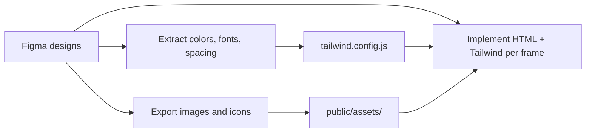
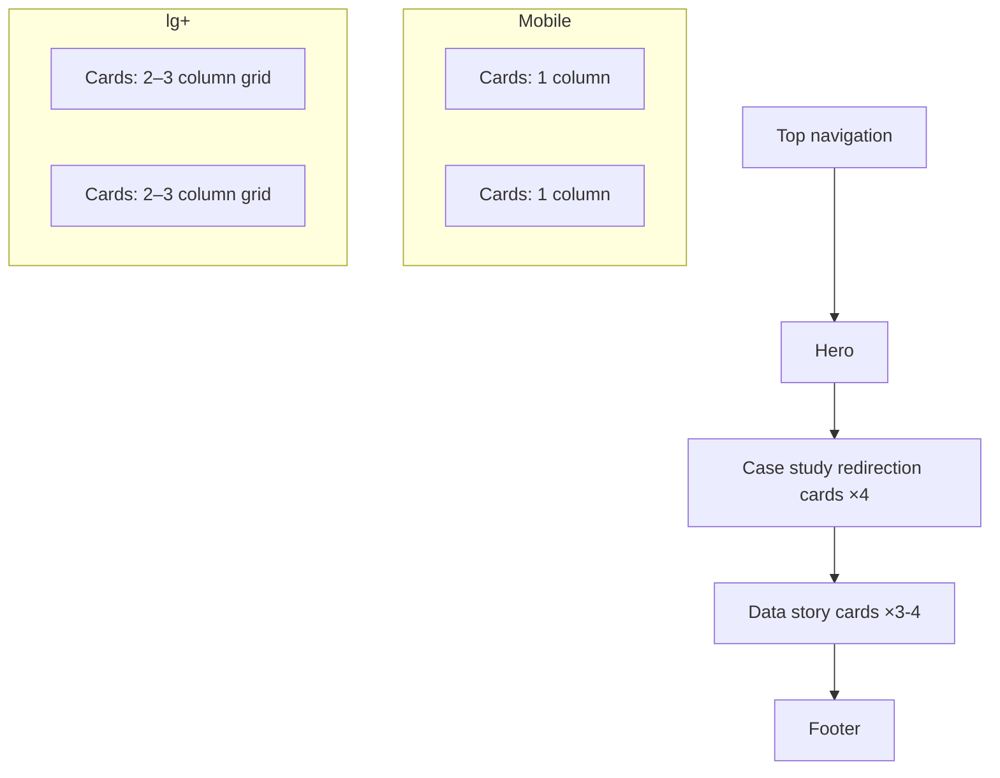

# Responsive portfolio website CSS project

## Summary

Plan for a Tailwind CSS responsive portfolio with a Home page plus detail pages for 4 case studies and 3–4 data stories. **Figma designs are the source of truth** — implement page-by-page from frames, extracting tokens and assets into Tailwind.

## Details

### Goals

- Showcase case studies and data stories across all screen sizes
- Use **Tailwind CSS** for rapid, consistent responsive layouts
- Ship fast, accessible pages with minimal custom CSS

### Tech stack

| Layer | Choice |
|-------|--------|
| Design | **Figma** (source of truth — layouts, tokens, assets) |
| CSS | **Tailwind CSS v4** (utility-first, mobile-first breakpoints) |
| Markup | Semantic HTML |
| JS | Minimal — mobile nav toggle, optional smooth scroll |
| Build | **Next.js 15** + Tailwind CSS v3 |
| Scaffold | `portfolio/` in this repo — see `portfolio/README.md` |
| Design source | **Paper** (paste links in `portfolio/PAPER_DESIGNS.md`) |

### Figma file

**File:** [Portfolio | AI Handoff](https://www.figma.com/design/VibdutrclLgS5EpFWgbJhH/Portfolio-%7C-AI-Handoff)

| Frame | Node | Link | Maps to |
|-------|------|------|---------|
| **Components** | `159:1626` | [Components](https://www.figma.com/design/VibdutrclLgS5EpFWgbJhH/Portfolio-%7C-AI-Handoff?node-id=159-1626) | Reusable atoms → organisms |
| **Desktop** | `159:2321` | [Desktop](https://www.figma.com/design/VibdutrclLgS5EpFWgbJhH/Portfolio-%7C-AI-Handoff?node-id=159-2321) | Home + detail pages at 1440px+ |
| **Mobile** | `104:19033` | [Mobile & tablet](https://www.figma.com/design/VibdutrclLgS5EpFWgbJhH/Portfolio-%7C-AI-Handoff?node-id=104-19033) | Home at 360px breakpoints |

#### Key Figma frames (implementation targets)

| Frame | Node ID | Use |
|-------|---------|-----|
| `home-template-splash` | `13:32059` (desktop), `104:18253` (mobile) | Hero section |
| `header_default_states_responsive` | `90:1771` | Nav at 360 / 768 / 1366 / 1600 / 1920 |
| `contact-strip-sticky` | `101:1714` | Footer / contact strip |
| `case-study-card-atomic-cpmponents` | `99:2367` | Case study redirection cards at all breakpoints |
| `smart-home` | `13:16849` | Full desktop home scroll state |

#### Component inventory (from Figma)

| Component | Variants | Notes |
|-----------|----------|-------|
| **Header** | 360, 768, 1366, 1600, 1920 | Brand lockup: `SHIVANI K.` + `v2026.vault` |
| **Hero splash** | behind / front / top / offset | Marble sculpture + animated value-prop text |
| **Text animation** | Left anchor + right dynamic | Rotating phrases (see below) |
| **Case study redirection card** | Hover yes/no × 4 projects | Links to detail pages: Insurance, Maternity, Smart Home, ERP |
| **Contact strip** | 360, 768, 1366, 1600, 1920 | Phone, email, LinkedIn, location/time |
| **Carousel** | Default / Variant2 | Case study carousel on home |
| **Sculpture blur** | Default / focus | Hero marble image with blur effect |

#### Case study redirection cards (4)

Each card on the Home page is a **link to a case study detail page** — not standalone content. Clicking a card navigates to `/case-studies/[slug]`.

| Card | Figma variant | Redirects to | Tags (example) |
|------|---------------|--------------|----------------|
| Insurance | `CS=Insurance` | `/case-studies/insurance` | RESPONSIVE, BFSI |
| Maternity | `CS=Maternity` | `/case-studies/maternity` | — |
| Smart Home | `CS=Smart Home` / `CS=IOT` | `/case-studies/smart-home` | — |
| ERP | `CS=ERP` | `/case-studies/erp` | — |

Each card has **hover variants** at every breakpoint (360 / 768 / 1366 / 1600 / 1920). Default state shows thumbnail + title; hover state reveals additional detail or visual change.

Section label in Figma: `PRODUCT_DESIGN // 01_SYSTEMS_FOR_USERS 02_SYSTEMS FOR_TEAMS`

#### Hero animated text (value props)

Left anchor cycles: `LEAD UI/UX`, `BUILDING SYSTEMS`, etc.
Right dynamic cycles: `AI NATIVE`, `MAINTAINABLE SYSTEMS`, `DOCUMENTATION`, `DATA & STORYTELLING`, `TEAM-AWARE PROCESSES`

Desktop example static text:
- Left: `.....|` + `PR`
- Right: `-|` (animated to full phrases)

Mobile example:
- Top: `AI NATIVE, LEAN UX` (blue)
- Bottom: `LEAD UI/UX - L1` + `PRODUCT_DESIGNER //AI NATIVE_LEAN UX_SYSTEMS_WORKFLOWS`

#### Design tokens (extracted from Figma variables)

```js
// tailwind.config.js — map from Figma variables
theme: {
  extend: {
    screens: {
      mobile: '360px',    // --fluid-breakpoint-mobile
      tablet: '768px',    // --fluid-breakpoint-tablet
      laptop: '1366px',   // --fluid-breakpoint-laptop-lg
      desktop: '1600px',  // --fluid-breakpoint-desktop-lg
      wide: '1920px',     // --fluid-breakpoint-desktop-xl
    },
    colors: {
      background: '#e5e3df',       // hero bg
      brand: { 700: '#0038d1', 900: '#1e3a8a' },
      blue: { 700: '#1d4ed8' },
      zinc: {
        50: '#fafafa', 100: '#f4f4f5', 400: '#a1a1aa',
        500: '#71717a', 600: '#52525b', 700: '#3f3f46',
        950: '#09090b',
      },
      neutral: {
        0: '#ffffff', 400: '#94a3b8', 500: '#64748b',
        700: '#334155', 900: '#0f172a', 950: '#020617',
      },
      card: { default: '#f5f5f4', hover: '#fafafa' },
      footer: { bg: '#f4f4f5', text: '#09090b' },
      nav: { bg: '#f4f4f5' },
    },
    fontFamily: {
      display: ['"Eurostile LT Std"', 'system-ui', 'sans-serif'],
      body: ['"Helvetica Neue"', 'system-ui', 'sans-serif'],
    },
    fontSize: {
      overline: '11px',
      label: { s: '11px', m: '12px', l: '14px' },
      body: { m: '16px', l: '18px', xl: '20px' },
      heading: { s: '18px', m: '28px', l: '40px' },
      title: '20px',
      button: '14px',
      code: '14px',
    },
    spacing: {
      xs: '4px', sm: '8px', md: '16px', xl: '32px',
    },
    borderRadius: { DEFAULT: '3px' },
  },
}
```

#### Design-to-code workflow



1. **Extract design tokens** — pull colors, font families, font sizes, spacing, and border radii from Figma variables/styles → map to `tailwind.config.js`
2. **Export assets** — hero images, card thumbnails, icons at 1× and 2× → `public/assets/images/`
3. **Build page-by-page** — start with Home, then case study template, then data story template
4. **Match breakpoints** — use Figma's custom breakpoints (360 / 768 / 1366 / 1600 / 1920), not default Tailwind
5. **Reuse components** — nav, card, and footer should match Figma components exactly across all pages

#### Figma → Tailwind token mapping

| Figma | Tailwind |
|-------|----------|
| Color styles | `theme.extend.colors` |
| Text styles | `theme.extend.fontSize` + `fontFamily` |
| Spacing (8pt grid) | Default Tailwind scale (`p-4`, `gap-6`, etc.) |
| Border radius | `rounded-lg`, `rounded-xl`, or custom `borderRadius` |
| Shadows | `shadow-sm`, `shadow-md`, or custom `boxShadow` |
| Breakpoints | Match Figma frame widths to `screens` in config |

#### Implementation order

| Step | Page | Why first |
|------|------|-----------|
| 1 | Home | Establishes nav, footer, card components, and tokens |
| 2 | Case study detail (template) | Reuse for all 4 — only content changes |
| 3 | Data story detail (template) | Reuse for all 3–4 — only content changes |
| 4 | Remaining detail pages | Duplicate templates, swap content |

### Site map

```
/                          → Home
/case-studies/[slug]       → Case study detail (×4)
/data-stories/[slug]       → Data story detail (×3–4)
```

| Page | Count | Purpose |
|------|-------|---------|
| **Home** | 1 | Hero + card grids linking to all work |
| **Case study detail** | 4 | Full project narrative — problem, process, outcome |
| **Data story detail** | 3–4 | Data viz / analysis narrative — context, charts, insights |

### Home page sections

| # | Section | Figma component | Content |
|---|---------|-----------------|---------|
| 1 | **Top navigation** | `header-*` | `SHIVANI K.` + `v2026.vault`, resume strip (desktop) |
| 2 | **Hero** | `home-template-splash` | Marble sculpture, animated value-prop text (left anchor + right dynamic) |
| 3 | **Case study redirection cards** | `case-study-card-*` | 4 linked cards → Insurance, Maternity, Smart Home, ERP detail pages. Hover variants per breakpoint. |
| 4 | **Data story cards** | TBD in Figma | 3–4 cards linking to data story detail pages |
| 5 | **Footer** | `contact-strip-sticky` / `psuedo-footer-*` | Phone, email, LinkedIn, location/time, "LET'S CONNECT" |

### Detail page sections (shared pattern)

**Case study detail**
- Hero image + title
- Overview (role, timeline, tools)
- Problem → Process → Solution → Outcome
- Image gallery / screenshots
- Prev / next navigation

**Data story detail**
- Hero + headline stat or viz thumbnail
- Context and data source
- Key charts / interactive embeds
- Insights and takeaways
- Prev / next navigation

### Recommended project structure

```
portfolio/
├── index.html                        # Home
├── case-studies/
│   ├── project-one.html
│   ├── project-two.html
│   ├── project-three.html
│   └── project-four.html
├── data-stories/
│   ├── story-one.html
│   ├── story-two.html
│   ├── story-three.html
│   └── story-four.html             # optional 4th
├── src/
│   └── input.css                     # @import "tailwindcss"
├── public/
│   └── assets/
│       ├── images/
│       └── fonts/
├── package.json
└── tailwind.config.js                # theme extensions (colors, fonts)
```

### Tailwind setup

```bash
npm init -y
npm install tailwindcss @tailwindcss/vite
```

```css
/* src/input.css */
@import "tailwindcss";
```

```js
// tailwind.config.js — extend with portfolio tokens
export default {
  theme: {
    extend: {
      colors: {
        accent: '#2563eb',
      },
      fontFamily: {
        sans: ['Inter', 'system-ui', 'sans-serif'],
      },
    },
  },
};
```

### Responsive strategy (Figma breakpoints → Tailwind)

| Figma breakpoint | Tailwind prefix | Card grid | Header |
|------------------|-----------------|-----------|--------|
| 360px (mobile) | `mobile:` | 1 column, stacked | Compact, 84px height |
| 768px (tablet) | `tablet:` | 2×2 grid | 117px height |
| 1366px (laptop) | `laptop:` | 4 across | 110px height |
| 1600px (desktop) | `desktop:` | 4 across | 134px height |
| 1920px (wide) | `wide:` | 4 across | 130px height |

Case study redirection card sizes by breakpoint:
- 1920: 455×240 | 1600: 375×220 | 1366: 316×180 | 768: 360×152 | 360: 344×120

### Home page layout



### Key Tailwind patterns

**Card grid (case study redirection cards)**
```html
<!-- Each card is an <a> linking to its detail page -->
<div class="grid grid-cols-1 tablet:grid-cols-2 laptop:grid-cols-4 gap-5">
  <a href="/case-studies/insurance"
     class="group rounded-sm overflow-hidden bg-stone-100 hover:bg-zinc-50 transition">
    
    <div class="p-3">
      <h3 class="font-display font-semibold group-hover:text-blue-700">INSURANCE</h3>
      <p class="text-xs text-zinc-500">RESPONSIVE · BFSI</p>
    </div>
  </a>
  <!-- Maternity, Smart Home, ERP — same pattern -->
</div>
```

**Responsive nav**
```html
<nav class="flex items-center justify-between px-6 py-4 max-w-7xl mx-auto">
  <a href="/" class="font-bold">Name</a>
  <ul class="hidden md:flex gap-6">
    <li><a href="#case-studies">Case Studies</a></li>
    <li><a href="#data-stories">Data Stories</a></li>
  </ul>
  <button class="md:hidden" aria-label="Open menu">☰</button>
</nav>
```

**Container + section spacing**
```html
<section class="max-w-7xl mx-auto px-6 py-16">
  <h2 class="text-2xl font-bold mb-8">Case Studies</h2>
  <!-- card grid -->
</section>
```

### Trade-offs

| Decision | Rationale |
|----------|-----------|
| Figma → Tailwind | Designs exist — implement from frames, not from scratch |
| Tailwind over vanilla CSS | 8+ pages with repeated card/nav/footer patterns — utilities reduce boilerplate |
| Static HTML over framework | Portfolio is content-driven, no app state — HTML + Tailwind is enough |
| Template detail pages | Build 1 case study + 1 data story frame in code, duplicate for the rest |

## Key takeaways

- **Figma file linked** — [Portfolio | AI Handoff](https://www.figma.com/design/VibdutrclLgS5EpFWgbJhH/Portfolio-%7C-AI-Handoff) with components, desktop, and mobile frames
- **Custom breakpoints**: 360 / 768 / 1366 / 1600 / 1920 — override Tailwind defaults
- **Fonts**: Eurostile LT Std (display) + Helvetica Neue (body)
- **4 case study redirection cards**: Insurance, Maternity, Smart Home, ERP — each links to a detail page, with hover variants at every breakpoint
- **Hero is complex**: animated text molecules + marble sculpture — build as dedicated component
- **8–9 pages total**: 1 Home + 4 case studies + 3–4 data stories
- In Cursor: reference Figma node URLs to implement frame-by-frame with design-to-code

## Related

- 
